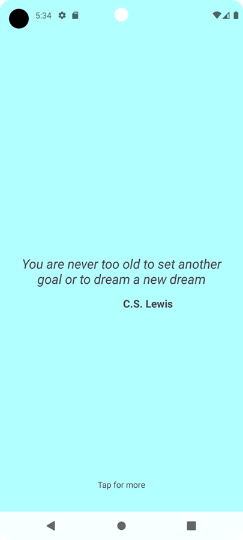

<h1>Positivity App</h1>
 
        <h2>Overview</h2>
        
Positivity App is an Android application designed to uplift and inspire users by displaying random motivational quotes and their authors. The app features a refresh button to show new quotes, providing a simple yet effective way to inject positivity into your day.

 
        <h2>Features</h2>
        <ul>
            <li><strong>Random Motivational Quotes</strong>: Displays random quotes with their authors.</li>
            <li><strong>Edge-to-Edge UI</strong>: Utilizes edge-to-edge display for a modern and immersive user experience.</li>
            <li><strong>Responsive Design</strong>: Adjusts padding based on system bars insets to ensure a comfortable layout on all devices.</li>
        </ul>
     
        <h2>Technology Stack</h2>
        <ul>
            <li><strong>Kotlin</strong>: Used for Android app development.</li>
            <li><strong>AndroidX</strong>: Includes ConstraintLayout for responsive UI design and other AndroidX libraries.</li>
            <li><strong>ViewCompat & WindowInsetsCompat</strong>: For handling edge-to-edge UI.</li>
            <li><strong>XML Layouts</strong>: For defining the UI components.</li>
        </ul>
 
        <h2>Getting Started</h2>
 
        <h3>Prerequisites</h3>
        <ul>
            <li>Android Studio</li>
            <li>An Android device or emulator running Android 5.0 (Lollipop) or higher</li>
        </ul>
 
        <h3>Installation</h3>
        <ol>
            <li>Clone the repository:
                <pre><code>git clone https://github.com/yourusername/positivity-app.git</code></pre>
            </li>
            <li>Open the project in Android Studio.</li>
            <li>Build and run the project on your preferred device or emulator.</li>
        </ol>
         
        <h3>Example images</h3>
         
        
                
 
        <h2>Contributing</h2>
        
Contributions are welcome! Please fork the repository and create a pull request with your changes.

 
        <h2>License</h2>
                
This project is licensed under the MIT License - see the <a href="LICENSE">LICENSE</a> file for details.

